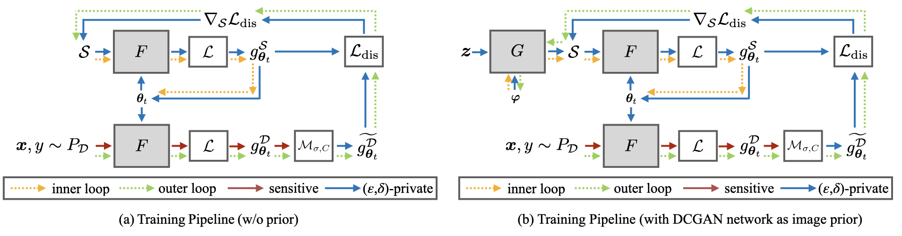

# Private-Set
[](LICENSE)
[](https://www.python.org/)
[](https://pytorch.org/)


This repository contains the implementation for ["Private Set Generation with Discriminative Information"](https://openreview.net/pdf?id=mxnxRw8jiru).

Contact: Dingfan Chen ([dingfan.chen@cispa.de](mailto:dingfan.chen@cispa.de))


## Requirements
This implementation is based on [PyTorch](https://www.anaconda.com/download/) (tested for version 1.7.1). Please refer to [requirements.txt](requirements.txt) for the other required packages and version. The differentially private training part is based on [Opacus](https://opacus.ai/) with version **0.15.0**. Note that due to significant refactoring, later versions of [Opacus](https://opacus.ai/) (>=1.0.0) is **not** compatible with our implementation. 

## Running Experiments
### Classification (without prior)
```main
python main.py \
--dataset "Dataset name" \
--exp_name "Experiment name" (name of the output directory) \
--spc "Number of samples per-class" \
--enable_privacy \
--target_epsilon "The target privacy level (default=10)"
```
- See ```main.py``` or run ```python main.py --help``` for a detailed descriptions of all supported arguments.
- Privacy cost computation is done by: automatically computing the required ```noise_multiplier``` given the desired ```target_epsilon```.   
- Dataset: ```'MNIST'```,```'FashionMNIST'```, ```'CIFAR10'``` has been tested.
- Number of samples per-class: ```spc``` $\in$ [1,10,20,50] has been tested.

### Classification (with DCGAN network as image prior)
```main prior
python main_prior.py \
--dataset "Dataset name" \
--exp_name "Experiment name" (name of the output directory) \
--spc "Number of samples per-class" \
--enable_privacy \
--target_epsilon "The target privacy level (default=10)"
```
- See ```main_prior.py``` or run ```python main_prior.py --help``` for a detailed descriptions of all supported arguments.
- Privacy cost computation is done by: automatically computing the required ```noise_multiplier``` given the desired ```target_epsilon```.   
- Dataset: ```'MNIST'```,```'FashionMNIST'``` has been tested.
- Number of samples per-class: ```spc``` $\in$ [1,10,20] has been tested.

### Continual (Class-incremental) learning 
```continual
cd continual_learning 
```
- Dataset: ```'MNIST'```,```'FashionMNIST'``` are supported.
- Run Ours 
    ```
    python main_ours.py \
    --dataset "Dataset name" \
    --exp_name "Experiment name" (name of the output directory) \
    --enable_privacy \
    --target_epsilon "The target privacy level (default=10)"
    ```
- Run DP-SGD baseline
    ```
    python main_dpsgd.py \
    --dataset "Dataset name" \
    --exp_name "Experiment name" (name of the output directory) \
    --enable_privacy \
    --target_epsilon "The target privacy level (default=10)"
    ```
- Run DP-Merf baseline
    ```
    python main_dpmerf.py \
    --dataset "Dataset name" \
    --exp_name "Experiment name" (name of the output directory) \
    --enable_privacy \
    --target_epsilon "The target privacy level (default=10)"
    ```


## Citation
```bibtex
@inproceedings{chen2022privateset,
  title={Private Set Generation with Discriminative Information},
  author={Chen, Dingfan and Kerkouche, Raouf and Fritz, Mario},
  booktitle={Neural Information Processing Systems (NeurIPS)},
  year={2022}
}
```

## Acknowledgements
Our implementation uses the source code from the following repositories:
- [Dataset Condensation](https://github.com/VICO-UoE/DatasetCondensation)
- [DCGAN prior from GS-WGAN](https://github.com/DingfanChen/GS-WGAN)
- [Class incremental learning](https://github.com/yaoyao-liu/class-incremental-learning)
- [DP-Merf baseline](https://github.com/frhrdr/dp-merf)
